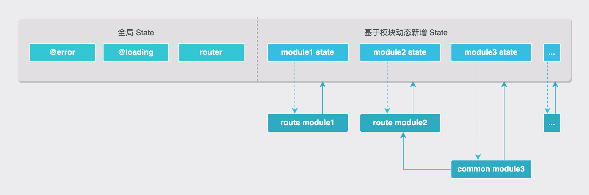

# Reaux CSR 解决方案

  

[Reaux-DOM](https://github.com/FE-Combo/reaux/tree/master/packages/reaux-dom) 是基于 Reaux 框架的客户端渲染（CSR）解决方案。框架继承了 Reaux 的特性，并添加了**全局异常处理（onError/onUnhandledRejection）**，集成了 **ErrorBoundary** 和 **Router** 组件，以及一系列实用**工具集（helper）**。这些功能使开发者能够更加灵活、高效地构建 CSR 应用。

### 安装

使用 npm 安装 reaux-dom：

```bash
npm install reaux-dom --save
```

### API

#### **start(opitons)**

使用 `start` 函数启动应用，并在浏览器中呈现 React 组件。该函数接受一个 `options` 对象作为参数。

```typescript
import { start } from "reaux-dom";
import { View } from "modules/main";
​
start({ Component: View, container: document.getElementById('framework-app-root') });
```

Reaux 将在 container 中呈现根组件（View 组件），并接管管理其中的 DOM。整个应用只进行一次调用。

**`入参 options`**

**Component**: React.ReactNode - 入口组件

**container**?: HTMLElement | true - 挂载容器。默认值为 true，指创建一个 id 为 `framework-app-root` 的 DOM 元素，也可自定义传入 DOM 元素

**onError**?: (error: Error) => void - 自定义 onerror 事件。默认会捕获 `event.error` 异常，并将其记录到 `redux["@error"]` 中，同时在控制台输出异常信息

**onUnhandledRejection**?: (error: Error) => void - 自定义 onunhandledrejection 事件。默认会捕获 `event.reason` 异常，并将其记录到 `redux["@error"]` 中，同时在控制台输出异常信息

**fallback**?: () => React.ReactNode - 当错误发生时需要展示的 UI

**historyMode**?: object - 路由模式，目前只支持 browserHistory 模式，设置为 null 可关闭路由。默认值为 browserHistory 模式

* type: "browserHistory"
* options?:
  * basename?: string 基准 URL
  * forceRefresh?: boolean 是否强制刷新页面
  * keyLength?: number location.key 的长度
  * getUserConfirmation?: (message: string, callback: (result: boolean) => void) => void 路由跳转时的确认函数

**name**?: string - 应用名称，在控制台输出显示应用名称。

#### **register(model, View)**

使用 `register` 函数注册模块。`register` 接受两个参数：一个是 model 实例，另一个是 React 组件。函数返回一个对象，其中包含 actions、View 和 proxyLifeCycle。

```typescript
import React from "react";
import {register, Model} from "reaux-dom";
​
interface State {}
const initialState: State = {};
​
class ActionHandler extends Model<State> {
    async onLoad() {
        console.log("onLoad");
    }
}
​
const {actions, View} = register(new ActionHandler("main", initialState), () => {
    return (
        <div>new module</div>
    )
});
```

Reaux 将继承自 Model 的 ActionHandler 挂载到 React 组件，以执行 Model 中的生命周期函数。在 View 组件中，可以调用 actions 中的函数触发 ActionHandler 中的同步/异步函数。

**`参数`**

**handler**: model 实例 - 继承自 Reaux Model

**View**: React.ReactNode - 一个 React 组件

**`返回值`**

**actions**: 调度 Model 中同步/异步函数的一组指令

**View**: 对入参 View 封装后生成的新 View（ModuleView）

**proxyLifeCycle**: 用于代理其他组件的生命周期

#### **helper**

一个实用工具集，包含了一系列常用的工具函数：

* **sleep**: (ms: number) =>void - 等待指定时间后执行下一步操作
* **loading**: (namespace?: string) => void - 装饰器，用于加载状态的管理。namespace 默认值为 'global'
* **interval**: (s: number) => void - 装饰器，仅适用于 onTick() 生命周期，指定以秒为单位的刻度间隔。s 默认值为 1 s

#### **build-in component**

* **Route**: 路由守卫组件，用于在导航到某个路由前或离开某个路由时执行特定的操作。
  * **path**: string - 路由路径
  * **withErrorBoundary**: boolean - 是否使用 ErrorBoundary 组件包裹
  * **accessCondition**: boolean - 是否允许访问
  * **unauthorizedRedirectTo**: string - 未授权时跳转的路由
  * **errorBoundaryFallback**: function - 当错误发生时将被调用。该函数应返回一个 React 元素，用于显示错误信息或提供错误处理 UI。
  * **component**: React.ReactNode - React 组件
  *   使用示例：

      ```typescript
      import React, { FC, memo } from 'react';
      import { Switch } from 'react-router-dom';
      import { Route } from 'reaux-dom';
      import { View as LoginView } from "modules/login"
      import { View as HomeView } from "modules/home"
      import cookie from 'js-cookie';
      ​
      export default memo(function MicroApp() {
          const hasAuth = !!cookie.get('sid');
          return (
              <Switch>
                  <Route path="/login" component={LoginView} />
                  <Route path="/home" accessCondition={hasAuth} unauthorizedRedirectTo="/login" component={HomeView} />
              </Switch>
          );
      });
      ```

### Model 拓展

React-DOM 中的 Model 继承了 Reaux Model 的特性，并增加了 **router** 属性：

* **onReady**: 在 View 初始化完成后触发（只会在首次加载时触发，卸载后重新挂载不会再次触发）
* **onLoad**: 与 componentDidMount 类似，View 加载后执行
* **onUpdate**: 与 componentDidUpdate 类似，View 状态时执行
* **onUnLoad**: 与 componentWillUnmount 类似，View 卸载时执行
* **onShow**: View 在视口中触发（无法使用于 proxyLifeCycle 组件）
* **onHide**: View 离开视口时触发（无法使用于 proxyLifeCycle 组件）
* **onTick**: 周期性调用（默认1s），配合 @helper.interval 装饰器可指定周期（以秒为单位）
* **state**: 当前 Model State
* **rootState**: 整个应用 State
* **resetState**: 重置当前 Model State
* **setState**: 更新当前 Model State
* **dispatch**: 触发 action
* **router**: 路由对象
  * push: (path: LocationDescriptorObject | string, state?: unknown) => void - 跳转到指定路径

### 状态树拓展

React-DOM 中的状态继承了 Reaux 状态树 的内置状态，并增加了 **router** 状态。&#x20;

<figure><figcaption></figcaption></figure>

### 快速创建应用

[**Reaux-CLI**](https://github.com/FE-Combo/reaux-cli) 是一个基于 Reaux 生态的脚手架工具，可快速创建一个 CSR 应用。使用如下命令安装：

```bash
npx reaux-cli init my-app ## 选择 reaux-dom 模板
cd my-app 
yarn && yarn dev
```

然后打开 `http://localhost:8080/` 查看应用。

当准备好部署到生产环境时，使用 **yarn build** 可创建一个压缩的静态资源包。

脚手架中使用 webpack 构建工具，并添加了通用配置。如果对构建工具和配置的选择不满意，可通过 **yarn eject** 暴露出配置文件，然后自行修改。**请注意：这是一种单向操作。一旦 eject 就无法返回！**

此外，[**Reaux-CLI**](https://github.com/FE-Combo/reaux-cli) 还提供了其他命令，以提高开发效率：

* 创建模块：`npx reaux-cli module <module-name>`
* 创建组件：`npx reaux-cli comp <component-name> [destination-path]`
* 更新全局状态：`npx reaux-cli state`
* 下载远程资源到本地：`npx reaux-cli download <source-url> <destination-path>`

### Docker 部署

[nginx docker 部署参阅](https://github.com/FE-Combo/reaux-dom-nginx-docker)

### Attentions

* onReady 生命周期只会在首次加载时触发，卸载后重新挂载不会再次触发
* 生命周期函数 onShow 和 onHide 无法使用于 proxyLifeCycle 组件
