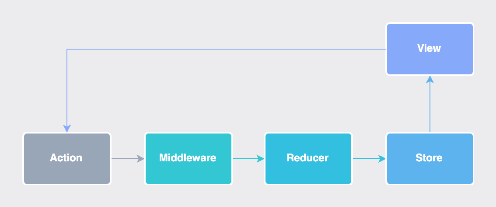
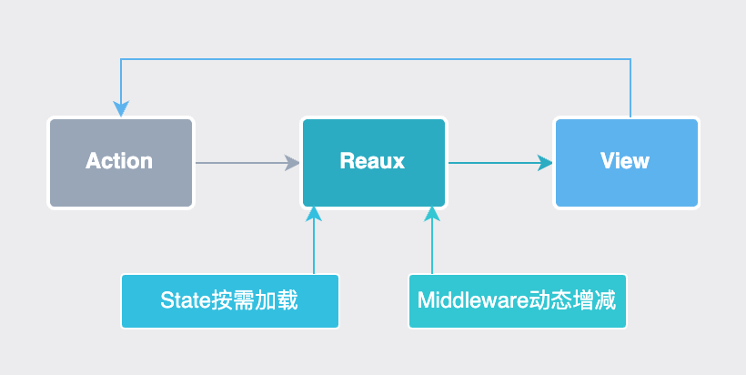
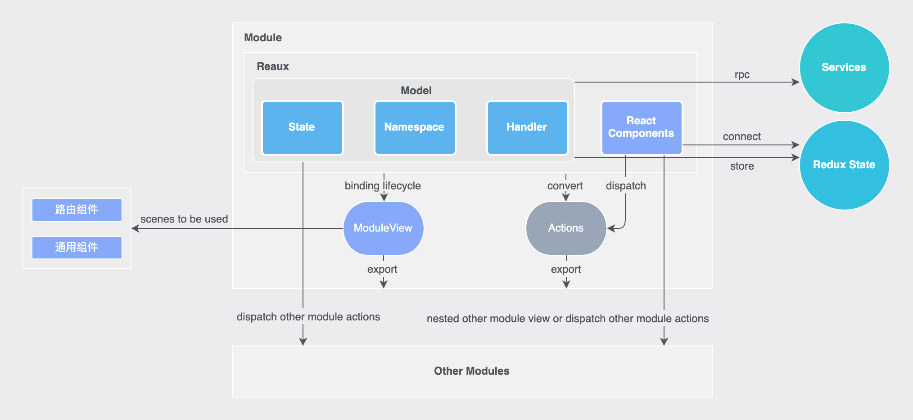
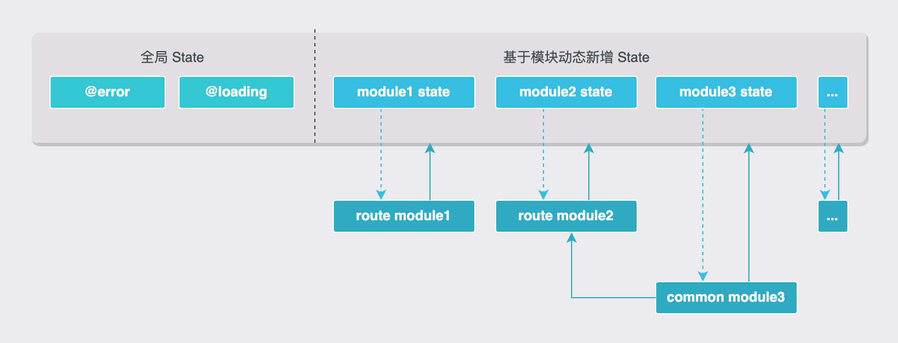

# Reaux 设计原理

<figure><figcaption></figcaption></figure>

现代前端开发中，构建强大的应用程序需要考虑**兼容性**、**数据流管理**和**代码结构的清晰性**。为解决传统 [React](https://react.dev/) 和 [Redux](https://redux.js.org/) 应用在开发中所遇到的挑战，诞生了 [Reaux](https://github.com/FE-Combo/reaux/tree/master/packages/reaux)。[Reaux](https://github.com/FE-Combo/reaux/tree/master/packages/reaux) 旨在实现**多端数据流同构**和**代码的高可读性**。同时充分发挥了 [TypeScript](https://www.typescriptlang.org/) 的优势，使代码更加**健壮**和**可维护**。

### 数据流

Redux 数据的变动源于用户或平台的操作而触发相应的 action，经过 middleware/reducer 处理后，更新 store 中的状态，最终通知订阅者更新 UI 组件。

<figure><figcaption></figcaption></figure>

Reaux 在 Redux 的基础上进行了精简和优化，内部完成了对 Reducer、Middleware 和 Store 的封装，简化了数据流的设计。它支持 **State 按需加载**、**Middleware 动态增减**，并采用**基于 Promise 的封装实现了异步方案**。&#x20;

<figure><figcaption></figcaption></figure>

### 设计理念

Reaux 采用**模块化设计**，将整个应用划分为多个独立的模块，并通过按需加载的方式实现高度灵活性。模块具有多重角色，可灵活应用于**通用组件**和**路由组件**。

作为通用组件时，它们被设计为可在整个应用中重复使用的独立功能单元。这种通用性使得开发人员可以将模块轻松地集成到不同的页面或场景中，提高了代码的**可重用性**和**可维护性**。

作为路由组件时，它们被嵌入到应用的导航结构中，负责处理特定的页面或视图。这种路由组件的设计使得应用能够以模块为基础构建**低耦合高内聚**页面结构，同时保持每个模块的**独立性**。

在模块内部，Reaux 借鉴了 **MVC 设计模式**的思想，将每个模块划分为三层：Model、View 和 Actions。其中 Model 负责数据的获取和处理，View 层负责界面的展示，Actions 负责业务逻辑的调度。

在模块注册阶段，通过传入 Model 实例和 View 实现特定生命周期的绑定。一旦注册完成，可生成 **Actions** 以及**新的 View（ModuleView）**，为界面构建和业务逻辑处理提供了便利和灵活性。

值得注意的是，**Model 和 View 属于模块内部封装**，在模块之间隔离，而**对外暴露 Actions 和 ModuleView**，设计上保障了系统的封装性和模块间的清晰交互。

简而言之，Reaux 的模块是指具有状态和特定生命周期的组件，并提供了指令集操作模块内部的状态和数据。

<figure><figcaption></figcaption></figure>

### Model（逻辑层）

Model 层采用**面向对象**的编程方式，每个 Model 包含**一个命名空间（moduleNamespace）**、**一个状态对象（moduleState）**，以及**多个同步/异步函数**。其设计初衷是封装数据获取和处理逻辑，实现与视图层的高度解耦。

在 Model 中集成了**对 State 的灵活操作**和**组件生命周期的管理**，使得开发过程更加灵活、高效。

* **onReady**: 在 View 初始化完成后触发。
* **onLoad**: 与 componentDidMount 类似，View 加载后执行
* **onUpdate**: 与 componentDidUpdate 类似，View 状态时执行，通常配合 connect 使用
* **onUnLoad**: 与 componentWillUnmount 类似，View 卸载时执行
* **onShow**: View 在视口中触发
* **onHide**: View 离开视口时触发
* **onTick**: 周期性调用（默认1s）
* **state**: 当前 Model State
* **rootState**: 整个应用 State
* **resetState**: 重置当前 Model State
* **setState**: 更新当前 Model State
* **dispatch**: redux dispatch

### View（视图层）

视图层采用 React 编写 UI 组件，通过 useSelector、useDispatch 或 connect 将状态和 dispatch 方法注入到组件中。通过调用 dispatch 触发 actions，实现对数据和状态的灵活操作。

### Actions（调度者）

Actions 是一组指令集，负责以同步方式调度 Model 中的同步/异步函数，其同步和异步调度能力使 Model 能够在不同的任务和场景中灵活应对。

### ModuleView

ModuleView 是对 View 的封装，它与 Model 中的生命周期函数绑定，以确保 View 在不同阶段能够执行特定的逻辑。

### 状态树

Reaux 的状态树涵盖了多个模块状态和内置状态（@error/@loading）。除了默认的 **@error** 和 **@loading** 外，每个模块都可以通过状态定义来反映其业务特征。

<figure><figcaption></figcaption></figure>

### build-in component

*   **ErrorBoundary**: 错误边界

    * **fallback**?: function 当错误发生时将被调用。该函数应返回一个 React 元素，用于显示错误信息或提供错误处理 UI。

    使用示例

    ```
        import { ErrorBoundary } from "reaux";
        function MyComponent() {
            throw new Error("This is an error");
        }

        function App() {
            return (
                <ErrorBoundary fallback={() => "An error occurred"}>
                    <MyComponent />
                </ErrorBoundary>
            );
        }
    ```
*   **Async**: 异步组件

    * **resolve**: () => Promise 异步加载完成后将返回 React 组件的数据。
    * **component**: string 它是模块导出的View命名。
    * **loadingComponent**?: React.ReactNode 异步加载完成之前要显示的加载中组件。

    使用示例

    ```
    import { Async } from "reaux";
    import { Spin } from 'antd';

    const AsyncLoadedComponent = Async(() => import(/* webpackChunkName: "my-component" */ 'modules/asyncComponent'), 'View', <Spin />);

    function App() {
        return (
            <AsyncLoadedComponent />
        )
    }
    ```

### 生态

Reaux 提供了多个解决方案，以适应不同的应用场景，包括客户端渲染（CSR）、服务端渲染（SSR）和跨平台移动应用程序。

[Reaux-DOM](https://github.com/FE-Combo/reaux/tree/master/packages/reaux-dom) 是基于 [Reaux](https://github.com/FE-Combo/reaux) 框架的客户端渲染（CSR）解决方案。框架集成了 Reaux 的特性，并监听**全局异常处理（onError/onUnhandledRejection）**，内置 **ErrorBoundary**、**BrowserRouter** 组件，且提供一系列**工具集（helper）**，使开发者能够快速构建 CSR 应用。

[Reaux-Next](https://github.com/FE-Combo/reaux/tree/master/packages/reaux-next) 是基于 [Reaux](https://github.com/FE-Combo/reaux) 框架的服务端渲染（SSR）解决方案，专为 Next.js 项目而设计并提供了一系列**工具集（helper）**，使开发者快速构建 SSR 应用。

[Reaux-Native](https://github.com/FE-Combo/reaux/tree/master/packages/reaux-native) 是基于 [Reaux](https://github.com/FE-Combo/reaux) 框架的跨平台移动应用程序解决方案，专为 React Native 项目而设计。它监听**全局异常处理（onError）**，并提供了一系列**工具集（helper）**，使开发者快速构建移动应用。

未来我们还有计划推出更多的解决方案，以满足不同的应用场景。

### FAQ

**相较于 dva 和 create react app 有什么优势？**

**状态按需加载**：我们提供了状态按需加载的功能，这意味着你可以按需加载应用状态，从而提高性能和加载速度。

**强大的类型安全和完善的 TypeScript 校验**：我们注重安全性，全面支持 TypeScript，确保代码更稳健、易维护。

**更完善的数据流方案和项目结构**：我们提供了一套完整的数据流方案，简化了数据管理，并设计清晰的项目结构，有助于开发者更轻松理解和维护代码。

**每个 action 都需要 dispatch，写法是否可以简化?**

Action 在 Redux 中的**本质**：在 Redux 中，action 的定义本身就是一个对象，需要 dispatch 才能生效。

**实现同步方式的异步逻辑**：这种写法允许通过同步方式实现异步逻辑，避免在视图层出现复杂的异步处理，提高代码可读性和维护性。

**所有 api 数据存在 redux 中是否有性能影响？**

性能问题主要分为三种：

* API 数据量太大：通过接口优化，可采用分页或删除不必要的字段等方式来减轻数据量。
* Redux 更新导致不必要的 React Diff：Redux 更新会触发 React Diff 过程，可使用 shallowEqual 进行优化，减少不必要的组件更新。
* 缓存过多的模块导致数据量太大：在组件卸载时，手动触发状态的重置，防止过多的缓存数据导致性能问题。通常情况下，这种情况较为罕见。

**视图层中使用异步方法会存在什么问题？**

虽然目前的 React 版本已经支持异步渲染（不会阻塞页面渲染进程）。但是我们仍然不建议在视图层中使用异步方法，因为这会导致视图层的代码变得复杂，不利于维护。我们建议将异步逻辑放在逻辑层中，通过 dispatch 触发 action，实现对数据和状态的灵活操作，使整体架构更清晰。
