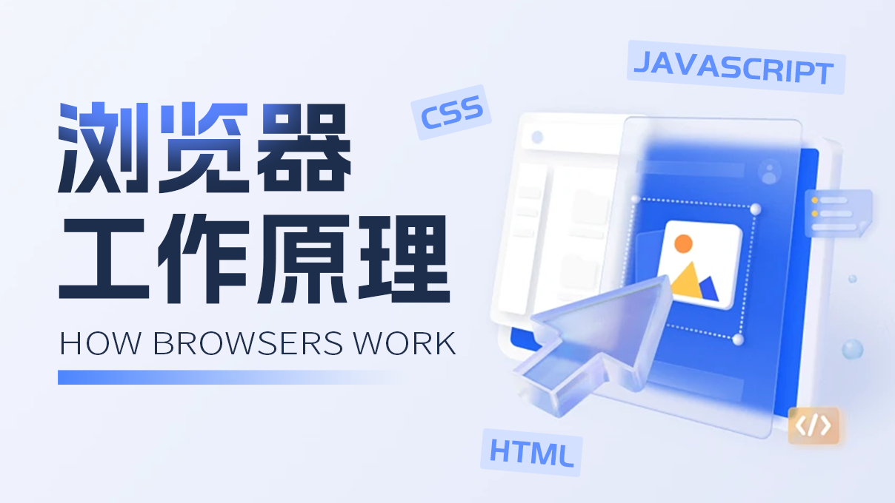

# 🌐 浏览器工作原理

<figure><figcaption></figcaption></figure>

简单来说，浏览器的核心任务是加载用户指定的网址（URI，统一资源标识符），然后将网页资源展示在浏览器窗口中。作为前端开发者，了解浏览器的结构有助于我们在开发过程中做出最优决策。

## 浏览器介绍

目前，市面上主要有五种[主流浏览器](https://gs.statcounter.com/)：Chrome、Safari、Edge、Opera 和 Firefox。这些浏览器使用不同的渲染引擎：

**Blink引擎**：由谷歌开发的Chromium浏览器项目采用Blink作为其渲染引擎，Blink 最初是从 WebKit 中分离出来的。除了Chrome，Microsoft Edge、Opera、Vivaldi等浏览器也使用Chromium作为基础，搭载了Blink渲染引擎。

**WebKit引擎**：最初由苹果开发并用于Safari浏览器的开源渲染引擎。尽管曾经基于WebKit开发过Chrome浏览器，但Chrome现已转向Blink引擎。

**Gecko引擎**：由Mozilla基金会开发的开源渲染引擎，一直用于Mozilla Firefox浏览器。

**Trident引擎**：由Microsoft开发的浏览器渲染引擎，曾用于Internet Explorer浏览器。但随着Microsoft Edge转向基于Chromium，Trident引擎的使用逐渐减少，新版Edge浏览器采用了Chromium的Blink引擎。

这些渲染引擎的不同选择对于前端开发者来说具有重要意义，因为它们在浏览器的行为和特性上会有一些差异。

### 浏览器发展过程

在2007年之前，市面上的浏览器通常采用**单进程架构**。这种单进程浏览器具有以下特点：

1. **不稳定**：如果进程中的任何一个线程执行出错，整个进程可能会崩溃，导致浏览器不稳定。
2. **不流畅**：在关闭进程之后，操作系统才会回收进程占用的内存。单进程浏览器无法主动回收内存，必须关闭浏览器才能回收内存。
3. **不安全**：单进程浏览器中的页面可以获取浏览器的全部权限（恶意程序获取系统权限），甚至可能攻击操作系统，造成安全隐患。

为了解决这些问题，现代浏览器采用了**多进程架构**，并通过安全沙箱解决安全问题（恶意程序也无法突破沙箱获取系统权限）。以Chrome为例，它于2008年引入了多进程架构。在多进程架构下，浏览器由多个独立的进程组成，彼此隔离，不会相互影响。每个进程包含多个线程，协同工作完成各自的任务。打开一个页面至少需要1个网络进程、1个浏览器进程、1个GPU进程以及1个渲染进程，共计4个进程。如果页面使用插件，还需要额外的插件进程（查看浏览器进程数可通过【页面右上角的三个点点点 -> 更多工具 -> 任务管理器】可打开相关面板）。

尽管多进程架构解决了不稳定和不流畅的问题，但也带来了更高的资源消耗。每个进程都包含一些公共基础结构的副本，因此浏览器会占用更多内存资源。为应对这一挑战，Chrome团队于2016年引入了"**面向服务的架构**"（SOA）思想，将Chrome的架构转向更灵活和可维护的方向。

在SOA架构下，Chrome将各模块拆分为独立的服务，每个服务提供特定功能，并通过网络通信。这提高了系统的可扩展性和灵活性。Chrome还采用了弹性架构，根据设备性能决定是否将服务整合到一个进程中，以节省内存。

这一演进使Chrome更趋向于现代操作系统的面向服务的架构，以满足其简单、稳定、高效和安全的目标。

<figure><figcaption></figcaption></figure>

## 请求链路

当在浏览器地址栏中输入 google.com 并按下回车键时，浏览器经历了一系列步骤，从开始加载到页面展示只需要短短几秒。下面我们来详细了解浏览器在这个过程中都做了些什么。

### 资源加载阶段

**beforeunload 事件检查**: 当用户按下回车键后，浏览器会首先触发当前页面的 beforeunload 事件，如果当前页面有监听该事件并且用户同意继续，浏览器才会继续加载新页面。

**URL 解析与 DNS 查询**: 用户输入的 URL 会传递给浏览器的主进程，主进程会解析 URL，包括自动补全协议、端口等，以确定要访问的协议、主机名、端口号等信息。然后，浏览器执行 DNS 查询，将主机名解析为对应的 IP 地址。

**缓存检查**: 浏览器在发送网络请求之前，进行缓存检查。缓存分为强缓存和协商缓存，它们决定了是否需要实际发送请求到服务器。这里是进行强缓存检测。如果缓存有效，资源将直接从本地缓存获取，无需建立 TCP 连接。

**建立 TCP 连接**: 如果资源的强缓存未命中或已过期，主进程会通知渲染进程，渲染进程通知网络进程，开始建立 TCP 连接，这是获取资源的必要步骤。

> #### 三次握手（建立连接）
>
> **第一步（客户端 -> 服务器）**：第一步（客户端 -> 服务器）：客户端发送带有SYN标志的TCP报文段，表示客户端希望建立连接，客户端进入SYN\_SEND状态。SYN的值是客户端的初始序列号（ISN）。
>
> **第二步（服务器 -> 客户端）**：服务器接收到客户端的SYN报文段后，回应一个带有ACK和SYN标志的TCP报文段，表示服务器同意建立连接，服务器进入SYN\_RECV状态。ACK的值是客户端的SYN+1, SYN的值是服务端的初始序列号（ISN）。
>
> **第三步（客户端 -> 服务器）**：客户端接收到服务器的响应后，发送一个带有ACK标志的TCP报文段，表示客户端确认连接建立。ACK的值是服务端的SYN+1。此时，连接已经建立，可以开始传输数据，客户端和服务器进入ESTABLISHED状态。

**TLS 握手**（仅适用于 HTTPS）: 如果请求协议是HTTPS，浏览器需要建立TLS加密连接。TLS握手是客户端和服务器之间会协商加密算法、交换密钥，其核心是加密HTTP报文给TCP传输，保障数据的安全。TLS握手在建立TCP连接后执行。

**发起 HTTP 请求**: 一旦TCP连接和可能的TLS连接建立，浏览器构建HTTP请求，包括请求方法、URL、请求头和请求体等信息。浏览器通过已建立的TCP连接将该请求发送给服务器。

**协商缓存检查**: 如果请求包含协商缓存条件头（If-None-Match 或 If-Modified-Since），服务器会检查资源是否有变化。如果没有变化，服务器返回 304 Not Modified 响应，告诉浏览器可以使用本地缓存。

**获取新资源**: 如果强缓存未命中或已过期，服务器会返回新的资源，包括 HTML、CSS、JavaScript、图像等。

**更新强缓存**: 浏览器将新获取的资源更新到本地缓存中并更新 Cache-Control 或 Expires 字段。

**更新协商缓存条件**: 浏览器更新协商缓存请求头，If-None-Match或If-Modified-Since更新为服务器最新生成的资源标识符（Etag或Last-Modified），以便进行下一次协商缓存验证。

**处理响应数据**: 浏览器根据响应头中的Content-Type字段来判断响应的数据类型，决定如何处理响应体的内容。根据Content-Type的值，浏览器可以将响应渲染成HTML页面、json数据、或者作为下载类型处理。

**断开TCP连接**：通过发送一个TCP FIN（终止）包来告知另一端结束连接。

> #### 四次挥手（中断连接）
>
> **第一步（客户端 -> 服务器）**：当客户端决定关闭连接时，它发送一个带有FIN标志的TCP报文段，表示客户端不再发送数据， FIN 的序列号（FIN值）应该是客户端当前发送的数据序列号加1。客户端进入FIN\_WAIT\_1状态。
>
> **第二步（服务器 -> 客户端）**：服务器接收到客户端的FIN报文段后，会发送一个带有ACK标志的TCP报文段，表示服务器确认客户端的关闭请求。但服务器仍然可以向客户端发送数据，ACK值为客户端FIN的序列号+1，服务器进入CLOSE\_WAIT状态。
>
> **第三步（服务器 -> 客户端）**：如果服务器也希望关闭连接，它会发送一个带有FIN标志的TCP报文段，表示服务器不再发送数据，FIN的序列号（FIN值）通常是根据上一次客户端传给服务器的ACK加1确定的，服务器进入LASK\_ACK状态。
>
> **第四步（客户端 -> 服务器）**：客户端接收到服务器的FIN报文段后，会发送一个带有ACK标志的TCP报文段，表示客户端确认服务器的关闭请求。此时，连接已经完全关闭，ACK值为上一步FIN值+1。

以上过程都是在主进程和网络进程中执行的，渲染阶段将在渲染进程中执行。

### 资源渲染阶段

浏览器的渲染进程接收到服务器的响应后，开始解析HTML、CSS和JavaScript，构建网页DOM树和渲染树，然后将网页内容显示在用户的屏幕上，需要注意的是渲染引擎是单线程。

**解析HTML**： 渲染进程收到HTML响应后，HTML解析器开始解析HTML文档。这包括识别文档的字符编码，构建DOM（Document Object Model）树。它是HTML文档的抽象表示，它以树状结构表示文档的元素、属性和内容，它是操作文档的通用规范。DOM 是由 W3C 组织指定的。

* 如果在 html 中存在 `` `<link>` 等标签，渲染进程会将这些任务转交给网络进程进行相关资源的下载。``和`<link>`的加载通常不会阻塞渲染进程，但可能会影响页面的呈现速度和用户体验，特别是在资源较大或网络速度较慢的情况下。优化加载顺序和资源大小可以改善页面加载性能。
* 当解析器到达 `<script>` 标记时立即解析并执行脚本。文档的解析将停止，直到脚本被执行。如果脚本是外部的，则必须首先从网络获取资源 ，并且解析将停止，直到获取资源为止。停止解析 html 的原因在于 JS 可能会改变 DOM 的结构。如果在脚本中添加“**defer**”属性，这样脚本就不会停止文档解析，而是在文档解析完成后执行。defer 属性只对外部脚本有效，对于内联脚本 defer 属性将被忽略。
* 若需要实现异步 HTML5 添加了一个选项**async**来将脚本标记为异步，这样它将由不同的线程解析和执行。但该脚本不能修改 DOM 树。
* `<script>`在未开启defer与async的情况下一般需要将script脚本放在文档底部，而不会阻塞页面解析和渲染。
* 浏览器会在解析 `<style>` 标签时也会阻塞 DOM 的解析和渲染。但 CSS 必须优先于 DOM 加载，主要原因是为了避免页面出现无样式内容的瞬间闪烁（**FOUC**，Flash of Unstyled Content）。对于这种问题一般有两种处理方式：
  1. 将 `<style>` 标签放在 `<head>` 部分（`<head>` 标签中的内容会被先解析和执行，然后才会继续解析和执行 `<body>` 标签中的内容），可以确保 CSS 规则尽早加载和解析，避免在 DOM 解析和渲染过程中造成延迟。
  2. 将 CSS 规则放在外部的 CSS 文件中，并通过 `<link>` 标签将其引入到 HTML 文档中。link标签加上rel="preload"属性，确保渲染之前提前加载资源。

**解析CSS**： 渲染进程会继续解析CSS文件，以确定如何渲染页面。这包括识别样式规则、计算元素的样式和确定元素的大小和位置。HTML和CSS规范由 W3C（万维网联盟）组织维护。

**构建渲染树**： 浏览器使用DOM树和CSS样式信息来构建渲染树（也称为渲染对象树或布局树）。但它并不包括所有的DOM元素。一些不可见的元素如display: none的元素不会出现在渲染树中，而visibility: hidden和opacity: 0的元素会出现在渲染树中，但在绘制阶段不可见。

**分层（Layering）**： 在渲染树构建之后，浏览器会将元素分层。分层让浏览器更有效地管理页面，减少重绘和回流的开销，使得浏览器可以更精确地重绘和回流需要变化的部分，而不是整个页面。某些图层可以受益于硬件加速，这意味着它们的渲染可以由GPU执行，而不是CPU。若要查看浏览器分层情况，您可以打开开发者模式并导航至“More tools” -> “Layers”。

**布局（Layout）**： 一旦有了渲染树，浏览器引擎会执行布局过程。布局过程确定了每个元素在视口中的确切位置和大小。这包括计算元素的边距、边框、填充以及相对于父元素的位置。

* HTML 使用基于流的布局模型，“流程中”较晚的元素通常不会影响“流程中”较早的元素的几何形状，因此布局可以在文档中从左到右、从上到下进行。
* 布局是一个递归过程，它从根渲染器开始，通常对应于 HTML 文档的 `<html>` 元素。在布局过程中，浏览器会递归遍历渲染树（Render Tree）的各个节点，为每个渲染器计算几何信息，包括位置、尺寸、边距、填充等。这个过程确保了页面上的元素按照正确的规则进行排列和布局。

**绘制（Paint）**： 一旦布局完成，渲染进程会遍历渲染树并执行绘制操作，将页面的内容绘制到屏幕上。这包括填充元素的背景颜色、绘制文本、边框等。如果是矢量图就直接显示在屏幕上，不需要走栅格化和合成的流程。

* _栅格化（Rasterization）_： 绘制阶段的一个子步骤，栅格化是将这些复杂效果转化为像素形式存储在内存中，以供合成使用。比如将图形操作转化成像素信息的过程。在某些情况下，栅格化可以借助图形处理单元（GPU）来执行，这可以显著提高性能。但是矢量图和部分css样式不需要像栅格图像一样经过栅格化的过程。
* _合成（Compositing）_：绘制阶段的一个子步骤，合成的主要任务是将已经经过栅格化的图像合并，包括处理多层嵌套元素之间的关系，以产生最终的视觉效果。矢量图形通常在渲染过程的早期阶段直接呈现，所以也不需要经过合成阶段。
* _显示_：绘制阶段的一个子步骤，浏览器将合成的图像传递给计算机的GPU（图形处理单元），由GPU负责将图像显示在用户的屏幕上。
* 布局确定了页面中元素的位置和大小不涉及绘制像素，而绘制是将这些元素渲染成可视的像素。布局是一种确定元素在页面上的占位和相对位置的过程，而绘制是将这些占位元素渲染成实际的图像以供用户看到。

**回流和重绘**： 当用户与页面交互或页面内容发生变化时，浏览器可能需要重新执行部分或全部渲染流程。这可能包括重新布局、重新绘制操作。

需要注意的是渲染引擎采用了一种称为"**渐进式渲染**"（Progressive Rendering）的方式，以提供更好的用户体验。渐进式渲染允许渲染引擎在仍在下载和解析页面的同时，尽早地显示部分内容在屏幕上，而不必等到整个HTML文档完全解析和构建渲染树后再显示。

### 持续通信阶段

持续通信阶段是浏览器与服务器之间通过维持连接以实现实时数据传输的过程。这一过程可以通过不同的应用层协议来实现，以下是关于不同协议的详细描述：

**HTTP**：在HTTP/1.1中，服务器可以选择使用`Connection: keep-alive`来表示愿意保持连接。这意味着一旦建立初始连接，浏览器和服务器之间的TCP连接将保持打开状态，以便实现更实时的数据传输，减少连接建立和断开的开销。而在HTTP/2和HTTP/3中，默认启用了该特性，无需显式指定Connection: keep-alive。

**Websocket**：WebSocket是一种全双工通信协议，它通过一个初始HTTP握手来建立连接，其中包含一个特殊的头部字段`Upgrade: websocket`。服务器在接收到这个请求后，如果支持WebSocket协议，将返回一个HTTP 101 Switching Protocols响应，表示协议切换成功，从而将HTTP连接升级为WebSocket连接。一旦建立WebSocket连接，客户端和服务器之间可以在任何时候互相发送消息，而无需等待请求-响应的模式。为了确保WebSocket连接保持活跃，客户端和服务器可以定期发送心跳消息。心跳消息通常是一个空的文本或二进制帧，用于告知对方连接仍然有效。当客户端或服务器决定关闭连接时，它们可以发送一个特殊的关闭帧来终止连接。WebSocket消除了HTTP的连接建立和关闭开销，提供高性能和效率，适用于实时应用如聊天和游戏。

**Server-Sent Events（SSE）**：SSE是一种基于HTTP的单向通信协议，服务器通过事件流向浏览器推送数据。浏览器通过一个特殊的EventSource对象并指定 SSE 服务器的端点 URL来建立连接，一旦建立连接，服务器可以实时发送事件数据给浏览器，请求响应头通常会包含`Content-Type: text/event-stream`。SSE适用于需要从服务器向客户端实时传递事件的场景，如实时新闻、股票报价、天气更新等。

**MQTT**：MQTT是一种物联网设备和应用之间的发布/订阅消息传输协议，是一种单向通信协议。它支持低带宽、高延迟或不稳定网络环境中的高效通信。MQTT主要用于设备间数据传递，支持消息广播和不同Quality of Service（QoS）级别以控制消息可靠性和交付保证。

## 总结

未来的浏览器领域充满活力，WebAssembly提供更高性能，渐进式Web应用（PWA）的兴起改善用户体验，包括离线访问和更快的加载速度，同时新的Web标准如WebRTC、WebVR和WebXR将带来更丰富的Web体验。

在浏览器的神奇世界中，无限可能等待着我们探索。
