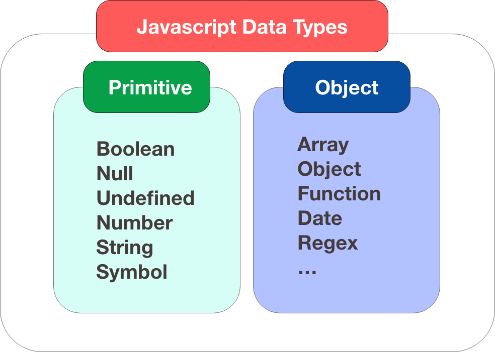
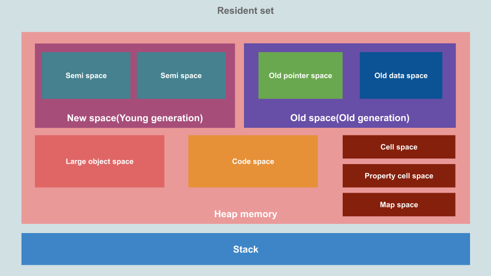
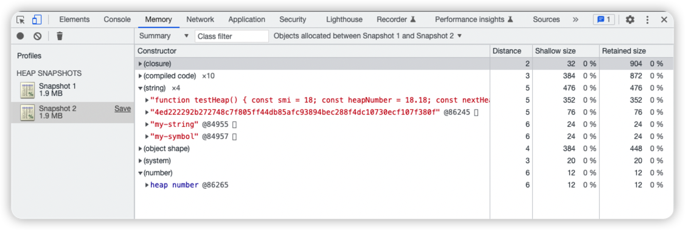
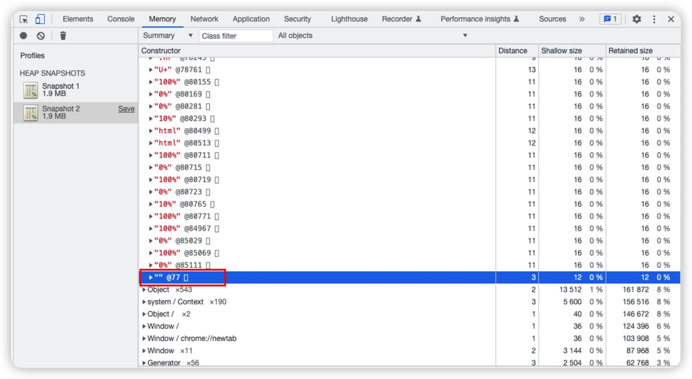
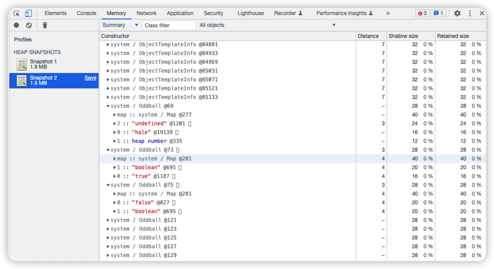
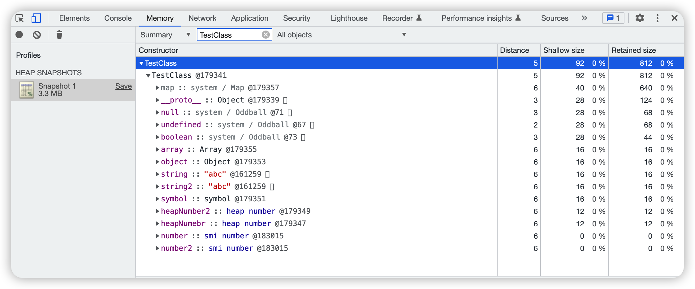
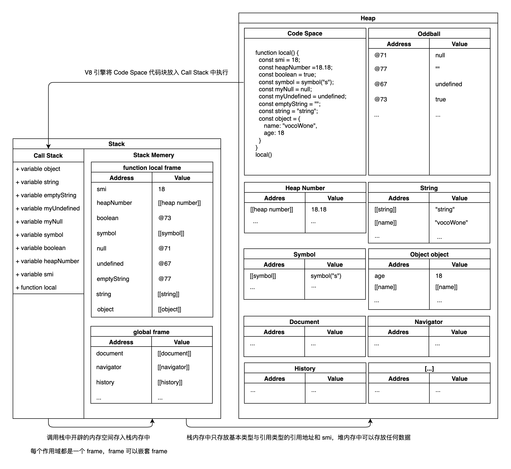

# 📉 内存管理

<figure><figcaption></figcaption></figure>

内存管理是编程语言的基本能力，JavaScript 中的内存管理是通过 [V8](https://v8.dev/) 完成的。V8 的实现遵循 [ECMA-262](https://tc39.es/ecma262/) 规范，规范中没有阐述内存布局以及内存管理相关信息，所以它的原理取决于[解释器](https://v8.dev/docs/ignition)的实现。唯一肯定的是不管任何编程语言，内存的生命周期是一致的：

1. 分配所需要的内存；
2. 使用分配的内存（读、写）；
3. 不需要时将其释放、归还。

基于此背景下本文试图通过内存的生命周期拓展 JavaScript 的内存布局知识。

开始分配内存之前需要先了解一下数据类型与数据结构。

## 数据类型

JavaScript 数据类型分为**`基本类型`**与**`引用类型`**。

<figure><figcaption><p>Data Type</p></figcaption></figure>

**基本类型**：在语言最低层且不可变的值称为原始值。所有原始值都可以使用 typeof 运算符测试所属基本类型（除了null，因为typeof null === "object"）。所有原始值都有它们相应的对象包装类（除了 null 和 undefined），这为原始值提供可用的方法。基本类型的对象包装类有 Boolean、Number、String、Symbol。

**引用类型**：表示内存中的可变的值，JavaScript 中对象是唯一可变的。Object、Array、函数等都属于对象。给对象定义属性可通过 Object.defineProperty() 方法，读取对象属性信息可通过 Object.getOwnPropertyDescriptor()。

基本类型与引用类型可以互转，转换的行为称为**`装箱`**与**`拆箱`**。

**装箱**：基本类型 => 引用类型 e.g: new String('call\_me')

**拆箱**：引用类型 => 基本类型 e.g: new String('64').valueOf()、new String('64').toString()

以下是一些开发过程中常见的类型转换：

* number -> string: let a = 1 => a+"" / String(a)
* string -> number: let a = "1" => +a / \~\~a / Number(a)
* any -> boolean: let a = {} => !a / !!a / Boolean(a)

从内存角度区分基本类型与应用类型，关键在于值在内存中是否可变，基本类型更新会重新开辟空间并改变指针地址，引用类型更新不会改变指针地址而指针所指向的对象更新；从代码上看，引用类型由基本类型和 {} 组成。

## 数据结构

<figure><figcaption><p>Resident Set</p></figcaption></figure>

JavaScript 程序运行时 V8 会给程序分配内存，这种内存称为**`Resident Set（常驻内存集合）`**，V8 常驻内存进一步细分成 **`Stack`** 和 **`Heap`**。

**Stack（栈）**是自动分配大小固定的内存空间，并由系统自动释放。栈数据结构遵循先进后出的原则，线性有序存储，容量小，系统分配效率高。

**Heap（堆）**是动态分配大小不固定的内存空间，不会自动释放（释放依赖 GC）。堆数据结构是一棵二叉树结构，容量大，速度慢。

一个线程只有一个栈内存空间，一个进程只有一个堆空间。

栈内存空间默认大小是 `864KB`，也可通过 `node --v8-options | grep -B0 -A1 stack-size` 查看。

栈结构其实经常可以看到，当写了一段报错代码时，控制台的错误提示就是一个栈结构。从下往上看调用路径，最顶部就是错误位置。例如最顶部抛出 Maxium call stack size exceeded 错误就代表当前调用超出了栈的限制。

堆中的结构划分为**`新空间（New Space）`**、**`旧空间（Old Space）`**、**`大型对象空间（Large object space）`**、**`代码空间（Code-space）`**、**`单元空间（Cell Space）`**、**`属性单元空间（Property Cell Space）`**和**`映射空间（Map Space）`**，新空间和旧空间在后面会详细介绍。

**大型对象空间（Large object space）**：大于其他空间大小限制的对象存放在这里。每个对象都有自己的内存区域，这里的对象不会被垃圾回收器移动。

**代码空间（Code-space**）：存储已编译的代码块，是唯一可执行的内存空间。

**单元空间（Cell Space）、属性单元空间（Property Cell Space）和映射空间（Map Space）**：这些空间分别存放 Cell，PropertyCell 和 Map。这些空间包含的对象大小相同，并且对对象类型有些限制，可以简化回收工作。

每个空间（除了大型对象空间（Large object space））都由若干个 `Page` 组成。一个 page 是由操作系统分配的一个连续内存块，一个内存块大小为 `1MB`。

从内存角度区分栈与堆，关键在于用完是否立即释放。

相信读者们看到这里肯定会联想到数据类型与堆栈的关联，网上和一些书籍的结论是：<mark style="color:red;">原始值分配在栈上，而对象分配在堆上。</mark>这个说法真的对吗？带着问题我们进入第二步：使用分配的内存。

## 内存模型

Node 提供了 [process.memoryUsage()](http://nodejs.cn/api/process/process\_memoryusage.html) 方法描述 Node.js 进程的内存使用情况（以字节 Bytes 为单位）

```
$ node
> process.memoryUsage()
```

假设原始值分配在栈上，而对象分配在堆上是对的，结合栈空间只有 `864KB`。如果我们声明一个 10MB 的字符串，看看堆内存是否会发生变化。

```
const beforeMemeryUsed = process.memoryUsage().heapUsed / 1024 / 1024;

const bigString = 'x'.repeat(10*1024*1024) // 10 MB
console.log(bigString); // need to use the string otherwise the compiler would just optimize it into nothingness

const afterMemeryUsed = process.memoryUsage().heapUsed / 1024 / 1024;

console.log(`Before memory used: ${beforeMemeryUsed} MB`); // Before memory used: 3.7668304443359375 MB
console.log(`After memory used: ${afterMemeryUsed} MB`); // After memory used: 13.8348388671875 MB
```

堆内存消耗接近 10 MB，说明**字符串存储在堆中**。

那么小字符串以及其他基本类型是否同样的存储在堆中呢，我们借助谷歌浏览器的 `Memery 堆快照（Heap snapshot）`进行分析。

打开谷歌浏览器无痕模式 Console 中输入以下代码，并分析执行前后的变量变化。

```
function testHeap() {
    const smi = 18;
    const heapNumber = 18.18;
    const nextHeapNumber = 18.18;
    const boolean = true;
    const muNull = null;
    const myUndefined = undefined;
    const symbol = Symbol("my-symbol");
    const emptyString = "";
    const string = "my-string";
    const nextString = "my-string";
}
testHeap()
```

<figure><figcaption><p>对比函数执行前后堆内存变化</p></figcaption></figure>

从图中可以看出函数执行后堆中变量分配情况。**小数、字符串、symbol 都开辟了堆空间，说明分配在堆中**。

有两个相同的"my-string"字符串，但并没有重复开辟两个字符串空间，因为 v8 内部存在名为 **stringTable 的 hashmap 缓存了所有字符串**，在 V8 阅读代码并转换为 AST 时，每遇到一个字符串都会换算为一个 hash 值插入到 hashmap 中。所以在我们创建字符串的时候，V8 会先从内存哈希表中查找是否有已经创建的完全一致的字符串，若存在，直接复用。若不存在，则开辟一块新的内存空间存储。这也是为什么字符串是不可变的，修改字符串时需要重新开辟新的空间而不能再原来的空间上作修改。

小整数、boolean、undefined、null、空字符串并没有额外开辟空间，对这些数据类型有两种猜测：

1. 存放在栈空间中；
2. 存放在堆中但在系统启动时就已经开辟。

<figure><figcaption><p>空字符串</p></figcaption></figure>

<figure><figcaption><p>Oddball</p></figcaption></figure>

V8 中有一个特殊的原始值子集，称为 **`Oddball`**。它们在运行之前由 V8 预先分配在堆上，无论 JavaScript 程序是否实际使用到它们。从整个堆空间查看这些类型的分配，**boolean、undefined、null、空字符串分配在堆内存中且属于 Oddball 类型**。无论何时分配空间对应的内存地址永远是固定的（空字符串`@77`、null`@71`、undefined`@67`、true`@73`）。但并未找到小整数，证明**函数局部变量小整数存在栈中**（定义在全局中的小整数则是分配在堆中）。

同样都是表示 Number 类型，小整数和小数在存储上有什么区别呢？

一般编程语言在区分 Number 类型时需要关心 Int、Float、32、64。在 JavaScript 中统称为 Number，但 v8 内部对 Number 类型的实现可没看起来这么简单，在 V8 内部 Number 分为 **`smi`** 和 **`heapNumber`**，分别用于存储小整数与小数（包括大整数）。ECMAScript 标准约定 Number 需要被当成 64 位双精度浮点数处理，但事实上一直使用 64 位去存储任何数字在时间和空间上非常低效的，并且 smi 大量使用位运算，所以为了提高性能 **JavaScript 引擎在存储 smi 的时候使用 32 位去存储数字而 heapNumber 使用 32 位或 64 位存储数字**。

以上是局部变量在函数中的内存分布，接下来验证对象的内存分布。谷歌浏览器无痕模式 Console 中输入以下代码，并在 `Class filter` 中输入 TestClass 查看其内存分布情况。

```
function TestClass() {
    this.number = 123;
    this.number2 = 123;
    this.heapNumebr = 123.18;
    this.heapNumber2 = 123.18;
    this.string = "abc";
    this.string2 = "abc";
    this.boolean = true;
    this.symbol = Symbol('test')
    this.undefined = undefined;
    this.null = null
    this.object = { name: 'pp' }
    this.array = [1, 2, 3];
}
let testobject = new TestClass()
```

<figure><figcaption><p>TestClass内存布局</p></figcaption></figure>

和上一个案例不同的是内存中多了 smi number 类型。由于**对象本身就存储在堆中，所以小整数也存储在堆中。shallow size 大小为 0，证明了小整数虽在堆中却不占内存空间**。是什么原因导致小整数不占内存空间？

这和 V8 中使用**`指针标记技术`**有关，指针标记技术使得指针标记位可以存储地址或者标记值。整数的值直接存储在指针中，而不必为其分配额外的存储空间；对象的值需要开辟额外内存空间，指针中存放其地址。这也导致了对象中的小整数数值相同但地址不同。

```
|------ 32位架构 -----|
|_____address_____ w1| 指针
|___int31_value____ 0| Smi

|---------------- 64位架构 ----------------|
|________base________|_____offset______ w1| 指针
|--------------------|___int31_value____ 0| Smi
```

V8 使用**最低有效位来区分 Smi 和对象指针**。对于对象指针，它使用第二个最低有效位来区分`强引用`和`弱引用`。

在 32 位架构中 Smi 值只能携带 31 位有效载荷。包括符号位，Int32类型的范围是 -(2^31) \~ 2^31 - 1, 所以Smi的范围实际上是Int31类型的范围（-(2^30) \~ 2^30 - 1）。对象指针有 30 位可用作堆对象地址有效负载。

由于单线程和 v8 垃圾回收机制的限制，内存越大回收的过程中 JavaScript 线程会阻塞且严重影响程序的性能和响应能力，出于性能以及避免空间浪费的考虑，大部分浏览器以及 Node15+ 的内存上限为 4G（4G 刚好是 2^32 byte）。以内存上限为 4G 为例，**V8 中的堆布局需要保证无论是 64 位系统还是 32 位系统都只使用32位的空间来储存**。在 64 位架构中 Smi 同样使用 31 位有效负载，与 32 位架构保持一致；对象指针使用 62 位有效负载，其中前 32 位表示 base（基址），其值指向 4G 内存中间段的地址。后 32 位的前 30 位表示 offset，指前后 2G 内存空间的偏移量。

v8 可以通过以下代码查看内存上限。

```
const v8 = require('v8')
console.log('heap_size_limit:',v8.getHeapStatistics().heap_size_limit) // 查询堆内存上限设置，不同 node 版本默认设置是不一样
```

通过设置环境 `export NODE_OPTIONS=--max_old_space_size=8192` 或者启动时传递 `--max-old-space-size`（或 `--max-new-space-size`）参数修改内存上限。

通过以上两个案例，细心的读者可能已经发现 heap number 作为函数私有变量时存在复用但作为对象的属性时不存在复用（地址不相同）。作者猜测函数中的私有变量做了类似字符串的 hashmap 优化，而作为对象属性时为了避免每次修改变量重新开辟空间而导致内存消耗大，无论数值是否相同都会重新开辟空间，修改时直接修改指针所指向的具体值。

以执行函数为例简单概括 JavaScript 的内存模型

<figure><figcaption><p>内存模型图</p></figcaption></figure>

## 垃圾回收机制及策略

使用完内存我们需要对内存进行释放以及归还，像 C 语言这样的底层语言一般都有底层的堆内存管理接口，比如 malloc() 和 free()。相反，JavaScript 是在创建变量（对象，字符串等）时自动进行了分配内存，并且在不使用它们时"自动"释放。释放的过程称为**`垃圾回收`**。释放过程不是实时的，因为其开销比较大，所以垃圾回收器会按照固定的时间间隔周期性的执行，这让 JavaScript 开发者错误的认为可以不关心垃圾回收机制及策略。

#### 引用计数法

这是最初级的垃圾收集算法。此算法把"对象是否不再需要"简化定义为"对象有没有其他对象引用到它"。假设有一个对象A，任何一个对象对A的引用，那么对象A的引用计数器+1，当引用清除时，对象A的引用计数器就-1，如果对象A的计算器的值为 0，就说明对象A没有引用了，可以被回收。

但该算法有个限制：**无法处理循环引用问题**。在下面的例子中，两个对象被创建，并互相引用，形成了一个循环。它们被调用之后会离开函数作用域，所以它们已经没有用了，可以被回收了。然而，引用计数算法考虑到它们互相都有至少一次引用，所以它们不会被回收。

```
function f(){
  var o = {};
  var o2 = {};
  o.a = o2; // o 引用 o2
  o2.a = o; // o2 引用 o
  return "";
}
f();
```

#### 标记清除法

这个算法把"对象是否不再需要"简化定义为"对象是否可达"，**解决了循环引用的问题**。这个算法假定设置一个叫做根（root）的对象（在 Javascript 里，根是全局对象）。垃圾回收器将定期从根开始，不具备可达性的元素将被回收。可达性指的是一个变量是否能够直接或间接通过全局对象访问到，如果可以那么该变量就是可达的，否则就是不可达。

但标记清除法对比引用计数法**`缺乏时效性`**，只有在有效内存空间耗尽了，V8引擎将会停止应用程序的运行并开启 GC 线程，然后开始进行标记工作。所以这种方式**效率低**，标记和清除都需要遍历所有对象，并且在 GC 时，需要停止应用程序，对于交互性要求比较高的应用而言这个体验是非常差的；通过标记清除算法清理出来的内容**碎片化较为严重**，因为被回收的对象可能存在于内存的各个角落，所以清理出来的内存是不连贯的。

#### 标记压缩算法

标记压缩算法是在标记清除算法的基础之上，做了优化改进的算法。和标记清除算法一样，也是从根节点开始，对对象的引用进行标记，在清理阶段，并不是简单的清理未标记的对象，而是将存活的对象压缩到内存的一端，然后清理边界以外的垃圾，从而**解决了碎片化的问题**。

标记压缩算法解决了标记清除算法的碎片化的问题，同时，标记压缩算法多了一步，对象移动内存位置的步骤，其效率也有一定的影响。

#### 增量标记法

标记压缩算法只解决了标记清除法的内存碎片化问题，但是没有解决停顿问题。为了减少全停顿的时间，V8 使用了如下优化，改进后，最大停顿时间减少到原来的1/6。

1. **增量 GC**：GC 是在多个增量步骤中完成，而不是一步完成。
2. **并发标记**： 标记空间的对象哪些是活的哪些是死的是使用多个辅助线程并发进行，不影响 JavaScript 的主线程。
3. **并发清扫/压缩**：清扫和压缩也是在辅助线程中并发进行，不影响 JavaScript 的主线程。
4. **延迟清扫**：延迟删除垃圾，直到有内存需求或者主线程空闲时再删除。

#### V8引擎垃圾回收策略

JavaScript 中的**`垃圾回收策略采用分代回收的思想`**。Heap（堆）内存中只有新空间（New Space）和旧空间（Old Space）由 GC 管理。

**新空间（New Space）**：新对象存活的地方，驻留在此处的对象称为**New Generation（新生代）**。Minor GC 作为该空间的回收机制，该空间采用 `Scavenge 算法 + 标记清除法`。

* Minor GC 保持新空间的紧凑和干净，其中有一个分配指针，每当我们想为新的对象分配内存空间时，就会递增这个指针。当该指针达到新空间的末端时，就会触发一次 Minor GC。这个过程也被称为 Scavenger，它实现了 Cheney 算法。由于空间很小（1-8MB 之间）导致 Minor GC 经常被触发，所以这些对象的生命周期都很短，而且 Minor GC 过程使用并行的辅助线程，速度非常快，内存分配的成本很低。
* 新空间由两个大小 Semi-Space 组成，为了区分二者 Minor GC 将二者命名为 from-space 和 to-space。内存分配发生在 from-space 空间，当 from-space 空间被填满时，就会触发 Minor GC。将还存活着的对象迁移到 to-space 空间，并将 from-space 和 to-space 的名字交换一下，交换后所有的对象都在 from-space 空间，to-space 空间是空的。一段时间后 from-space 又被填满时再次触发 Minor GC，第二次存活的对象将会被迁移到旧空间（Old Space），第一次存活下来的新对象被迁移到 to-space 空间，如此周而复始操作就形成了 Minor GC 的过程。

**旧空间（Old Space）**：在新空间（New Space）被两次 Minor GC 后依旧存活的对象会被迁移到这里，驻留在此处的对象称为**Old Generation（老生代）**。 Major GC 作为该空间的回收机制，该空间采用`标记清除、标记压缩、增量标记算法`。

* V8 根据某种算法计算，确定没有足够的旧空间就会触发 Major GC。Cheney 算法对于小数据量来说是完美的，但对于 Heap 中的旧空间来说是不切实际的，因为算法本身有内存开销，所以 Major GC 使用标记清除、标记整理、增量标记算法。
* 旧空间分为旧址针空间和旧数据空间：旧指针空间包含具有指向其他对象的指针的对象；旧数据空间包含数据的对象（没有指向其他对象的指针）。

## 内存泄漏

并不是所有内存都会被回收，当程序运行时由于某种原因未能被 GC 而造成内存空间的浪费称为**`内存泄漏`**。轻微的内存泄漏或许不太会对程序造成什么影响，严重的内存泄漏则会影响程序的性能，甚至导致程序的崩溃。

以下是一些导致内存泄漏的场景

#### 闭包

```
var theThing = null;
const replaceThing = function () { 
  var originalThing = theThing; 
  
  var unused = function () { 
    if (originalThing) 
      console.log("hi"); 
  }; 
  
  theThing = { 
    longStr: new Array(1000000).join('*'), 
    someMethod: function () { 
      console.log("someMessage"); 
    } 
  };
  // 如果在此处添加 `originalThing = null`，则不会泄漏。
};
setInterval(replaceThing, 1000);
```

这是一个非常经典的闭包内存泄漏案例，unused 中引用了 originalThing，所以强制它保持活动状态，阻止了它的回收。unused 本身并未被使用所以函数执行结束后会被 gc 回收。但 somemethod 与 unused 在同一个上下文，共享闭包范围。每次执行 replaceThing 时闭包函数 someMethod 中都会引用上一个 theThing 对象。

#### 意外的全局变量

```
function foo(arg) { 
    bar = "隐式全局变量"; 
}
// 等同于：
function foo(arg) { 
    window.bar = "显式全局变量"; 
}
```

定义大量的全局变量会导致内存泄漏。在浏览器中全局对象是“ window”。在 NodeJs 中全局对象是“global”或“process”。此处变量 bar 永远无法被收集。

还有一种情况是使用 this 生成全局变量。

```
function fn () {
    this.bar = "全局变量"; // 这里的  this 的指向 window, 因此 bar 同样会被挂载到 window 对象下
}
fn();
```

避免此问题的办法是在文件头部或者函数的顶部加上 'use strict', 开启严格模式使得 this 的指向为 undefined。

若必须使用全局变量存储大量数据时，确保用完后设置为 null 即可。

#### 忘记清除定时器

setInterval/setTimeout 未被清除会导致内存泄漏。在执行 clearInterval/clearTimeout 之前，系统不会释放 setInterval/setTimeout 回调函数中的变量，及时释放内存就需要手动执行clearInterval/clearTimeout。

若 setTimeout 执行完成则没有内存泄漏的问题，因为执行结束后就会立即释放内存。

#### 忘记清除事件监听器

当组件挂载事件处理函数后，在组件销毁时不主动将其清除，事件处理函数被认为是需要的而不会被 GC。如果内部引用的变量存储了大量数据，可能会引起页面占用内存过高，造成内存泄漏。

#### 忘记清除 DOM 引用

把 DOM 存储在字典（JSON 键值对）或者数组中，当元素从 DOM 中删除时，而 DOM 的引用还是存于内存中，则 DOM 的引用不会被 GC 回收而需要手动清除，所以存储 DOM 通常使用弱引用的方式。

#### 旧版浏览器和错误扩展

旧版浏览器 (IE6–7) 因无法处理 DOM 对象和 JavaScript 对象之间的循环引用而导致内存泄漏。

有时错误的浏览器扩展可能会导致内存泄漏。

### 内存泄漏排查

常用的内存泄漏排查方式有四种：

1. 使用 Chrome 浏览器的 Performance 查看是否存在内存泄漏，使用 Memory 定位泄漏源。
2. 使用 Node.js 提供的 process.memoryUsage 方法，查看 `heapUsed` 走势；
3. 使用`node --inspect xxx.js`启动服务并访问`chrome://inspect`，打开 Memory 定位泄漏源；
4. 应用接入 grafana 的前提下，可通过 ab 压测观察 grafana 内存走势。

内存分布对大部分开发者来说都是一个黑盒，v8 中实现的 JavaScript 内存模型非常复杂，99% 的开发都不用去关心，甚至在 ECMAScript 规范中也没有找到任何关于内存布局的信息。若是兴趣使然，完全可以看看 v8 引擎的源码。在工作中如果你已经开始专研 JavaScript 内存分布的问题，说明你有能力开始编写更底层的语言了。

本文并非在阅读源码的情况下作出的结论，而是根据内存分析工具结合现有的理论作出的结论，若有不足之处欢迎纠正。
