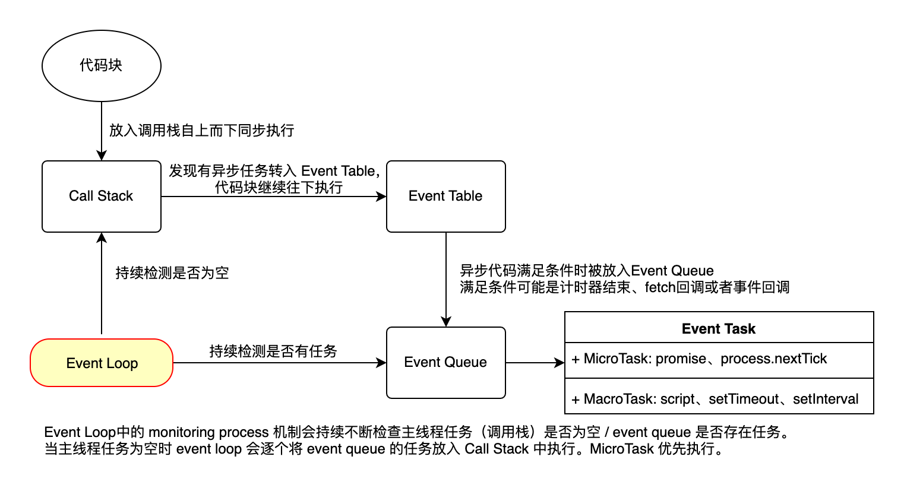

# 🌄 三座大山

js 作为前端的中坚力量。那么 javascript 三座大山，你知道是哪些呢？

## 1️⃣ 作用域和闭包

**`作用域`** 指代码当前上下文，控制着变量和函数的可见性和生命周期。最大的作用是隔离变量，不同作用域下同名变量不会冲突。

**`作用域链`** 指如果在当前作用域中没有查到值，就会向上级作用域查询，直到全局作用域，这样一个查找过程所形成的链条就被称之为作用域链。

作用域可以堆叠成层次结构，子作用域可以访问父作用域，反之则不行。

作用域具体可细分为四种：**`全局作用域`**、**`模块作用域`**、**`函数作用域`**、**`块级作用域`**

**全局作用域：** 代码在程序的任何地方都能被访问，例如 window 对象。但全局变量会污染全局命名空间，容易引起命名冲突。

**模块作用域：** 早期 js 语法中没有模块的定义，因为最初的脚本小而简单。后来随着脚本越来越复杂，就出现了模块化方案（AMD、CommonJS、UMD、ES6模块等）。通常一个模块就是一个文件或者一段脚本，而这个模块拥有自己独立的作用域。

**函数作用域：** 顾名思义由函数创建的作用域。闭包就是在该作用域下产生，后面我们会单独介绍。

**块级作用域：** 由于 js 变量提升存在变量覆盖、变量污染等设计缺陷，所以 ES6 引入了块级作用域关键字来解决这些问题。典型的案例就是 let 的 for 循环和 var 的 for 循环。

```javascript
// var demo
for(var i=0; i<10; i++) {
    console.log(i);
}
console.log(i); // 10

// let demo
for(let i=0; i<10; i++) {
    console.log(i);
}
console.log(i); //ReferenceError：i is not defined
```

了解完作用域再来谈谈 **`闭包`：**函数A里包含了函数B，而函数B使用了函数A的变量，那么函数B被称为闭包或者闭包就是能够读取函数A内部变量的函数。

可以看出闭包是函数作用域下的产物，闭包会随着外层函数的执行而被同时创建，它是一个函数以及其捆绑的周边环境状态的引用的组合。换而言之，**闭包是内层函数对外层函数变量的不释放**。

**闭包的特征：**

* 函数中存在函数；
* &#x20;内部函数可以访问外层函数的作用域；
* 参数和变量不会被 GC，始终驻留在内存中；
* 有内存地方才有闭包。

所以使用闭包会消耗内存、不正当使用会造成内存溢出的问题，在退出函数之前，需要将不使用的局部变量全部删除。如果不是某些特定需求，在函数中创建函数是不明智的，闭包在处理速度和内存消耗方面对脚本性能具有负面影响。

**以下罗列了一些闭包的应用场景：**

<pre class="language-typescript" data-title="循环中使用"><code class="lang-typescript"><strong>// demo1 输出 3 3 3
</strong>for(var i = 0; i &#x3C; 3; i++) {
    setTimeout(function()ty
        console.log(i);
    }, 1000);
} 
// demo2 输出 0 1 2
for(let i = 0; i &#x3C; 3; i++) {
    setTimeout(function() {
        console.log(i);
    }, 1000);
}
// demo3 输出 0 1 2
for(let i = 0; i &#x3C; 3; i++) {
    (function(i){
        setTimeout(function() {
        console.log(i);
        }, 1000);
    })(i)
}
</code></pre>


```typescript
// 模拟对象的get与set方法
var Counter = (function() {
var privateCounter = 0;
function changeBy(val) {
    privateCounter += val;
}
return {
    increment: function() {
    changeBy(1);
    },
    decrement: function() {
    changeBy(-1);
    },
    value: function() {
    return privateCounter;
    }
}
})();
console.log(Counter.value()); /* logs 0 */
Counter.increment();
Counter.increment();
console.log(Counter.value()); /* logs 2 */
Counter.decrement();
console.log(Counter.value()); /* logs 1 */
```



```typescript
// setTimeout中使用，setTimeout(fn, number): fn 是不能带参数的。使用闭包绑定一个上下文可以在闭包中获取这个上下文的数据。
function func(param){ return function(){ alert(param) }}
const f1 = func(1);setTimeout(f1,1000);
```



```typescript
/*不使用闭包*/
//生产者
function producer(){
    const data = new（...）
    return data
}
//消费者
function consumer(data){
    // do consume...
}
const data = producer()

/*使用闭包*/
function process(){
    var data = new (...)
    return function consumer(){
        // do consume data ...
    }
}
const processer = process()
processer()
```



```typescript
// 以下两种方式都可以实现继承，但是闭包方式每次构造器都会被调用且重新赋值一次所以，所以实现继承原型优于闭包
// 闭包
function MyObject(name, message) {
  this.name = name.toString();
  this.message = message.toString();
  this.getName = function() {
    return this.name;
  };

  this.getMessage = function() {
    return this.message;
  };
}
// 原型
function MyObject(name, message) {
  this.name = name.toString();
  this.message = message.toString();
}
MyObject.prototype.getName = function() {
  return this.name;
};
MyObject.prototype.getMessage = function() {
  return this.message;
};
```


对于闭包的概念好像懂了但又好像缺少了啥？意犹未尽。我也曾也闭包中迷失，但是看完闭包的生命周期让我重新找回自己。

<figure><figcaption><p>一张图看懂闭包的生命周期</p></figcaption></figure>

学完就来一波牛刀小试

```typescript
function test(a, b){
  console.log(b);
  return {
    test: function(c) {
      return test(c,a);
    }
  }
}

var a = test(100);a.test(101);a.test(102);
var b = test(200).test(201).test(202);
var c = test(300).test(301);c.test(302);

// undefined  100  100
// undefined  200 201
// undefined  300 301
```

## 2️⃣ 原型和原型链

有对象的地方就有**`原型`**，每个对象都会在其内部初始化一个属性，就是prototype(原型)，原型中存储共享的属性和方法。当我们访问一个对象的属性时，js引擎会先看当前对象中是否有这个属性，如果没有的就会查找他的prototype对象是否有这个属性，如此递推下去，一直检索到 Object 内建对象。这么一个寻找的过程就形成了**`原型链`**的概念。

理解原型最关键的是理清楚\_\_proto\_\_、prototype、constructor三者的关系，我们先看看几个概念：

* **\_\_proto\_\_属性**在所有对象中都存在，指向其构造函数的prototype对象；**prototype对象**只存在（构造）函数中，用于存储共享属性和方法；**constructor属性**只存在于（构造）函数的prototype中，指向（构造）函数本身。
* 一个对象或者构造函数中的**隐式原型\_\_proto\_\_**的属性值指向其构造函数的**显式原型 prototype** 属性值，关系表示为：`instance.__proto__ === instance.constructor.prototype`
* 除了 Object，所有对象或构造函数的 prototype 均继承自 Object.prototype，原型链的顶层指向 null：`Object.prototype.__proto__ === null`
* Object.prototype 中也有 constructor：`Object.prototype.constructor === Object`
* 构造函数创建的对象（Object、Function、Array、普通对象等）都是 Function 的实例，它们的 \_\_proto\_\_ 均指向 Function.prototype。

看起来是不是有点乱？？别慌！！一张图帮你整理它们之间的关系

<figure><figcaption><p>原型关系图</p></figcaption></figure>

相同的配方再来一刀

```typescript
const arr = [1, 2, 3];
arr.__proto__ === Array.prototype; // true
arr.__proto__.__proto__ === Object.prototype; // true
Array.__proto__ === Function.prototype; // true
```

## 3️⃣ 异步和单线程

JavaScript 是**`单线程`**语言，意味着只有单独的一个调用栈，同一时间只能处理一个任务或一段代码。队列、堆、栈、事件循环构成了 js 的并发模型，**`事件循环`**是 JavaScript 的执行机制。

为什么js是一门单线程语言呢？最初设计JS是用来在浏览器验证表单以及操控DOM元素，为了避免同一时间对同一个DOM元素进行操作从而导致不可预知的问题，JavaScript从一诞生就是单线程。

既然是单线程也就意味着不存在异步，只能自上而下执行，如果代码阻塞只能一直等下去，这样导致很差的用户体验，所以事件循环的出现让 js 拥有异步的能力。

<figure><figcaption><p>事件循环链路图 </p></figcaption></figure>

以上就是关于js三座大山的全部内容。什么？还不懂，告诉我ip地址我顺着网线过去教你！！
