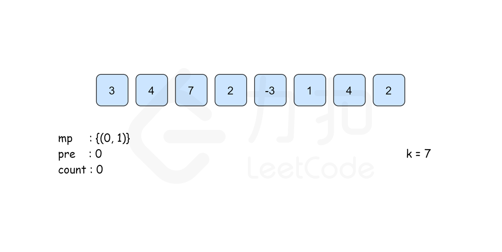

# 和为 K 的子数组

[**leetcode 题目链接**](https://leetcode.cn/problems/subarray-sum-equals-k/description/)

给你一个整数数组 `nums` 和一个整数 `k` ，请你统计并返回 _该数组中和为 k_ _的子数组的个数_ 。

子数组是数组中元素的**连续**非空序列。

**示例 1：**

<pre><code><strong>输入：nums = [1,1,1], k = 2
</strong><strong>输出：2
</strong></code></pre>

**示例 2：**

<pre><code><strong>输入：nums = [1,2,3], k = 3
</strong><strong>输出：2
</strong></code></pre>

**提示：**

* `1 <= nums.length <= 2 * 104`
* `-1000 <= nums[i] <= 1000`
* `-107 <= k <= 107`

## 前缀和

**思路及算法**

使用前缀子数组和的计算方式。通过维护一个Map，其中**键**是**前缀和**，**值**是该前缀和出现的**次数。**由于前缀和是累加的，两个前缀和的差表示两个位置之间的子数组的和（前缀和减另一个前缀和表示去除两个前缀和的重叠部分，留下来的是前一个前缀和数组的末端下标到后一个前缀和的末端下标的子数组）。

1. 初始化前缀和为0的个数为1，即 `sumMap.set(0, 1)`。
2. 遍历数组，累加当前位置的元素，计算当前位置的前缀和 `sum`。
3. 对于每个 `sum`，检查是否存在前缀和为 `sum - k` 的位置。如果存在，则说明从那个位置到当前位置的子数组和为 k。
4. 统计符合条件的子数组的个数。
5. 更新前缀和的个数。




<figure><figcaption></figcaption></figure>



<figure><figcaption></figcaption></figure>



<figure><figcaption></figcaption></figure>



<figure><figcaption></figcaption></figure>



<figure><figcaption></figcaption></figure>



<figure><figcaption></figcaption></figure>



<figure><figcaption></figcaption></figure>



<figure><figcaption></figcaption></figure>



<figure><figcaption></figcaption></figure>



```typescript
function subarraySum(nums, k) {
    let count = 0;
    let sum = 0;
    const sumMap = new Map();
    
    sumMap.set(0, 1); // 初始化前缀和为0的个数为1
    
    for (let num of nums) {
        sum += num; // 计算当前位置的前缀和

        // 如果存在前缀和为 sum - k 的位置，则说明从那个位置到当前位置的子数组和为 k
        if (sumMap.has(sum - k)) {
            count += sumMap.get(sum - k);
        }

        // 更新前缀和的个数
        if (sumMap.has(sum)) {
            sumMap.set(sum, sumMap.get(sum) + 1);
        } else {
            sumMap.set(sum, 1);
        }
    }

    return count;
}
```

**复杂度分析**

* 时间复杂度：$$O(N)$$
* 空间复杂度：$$O(N)$$
